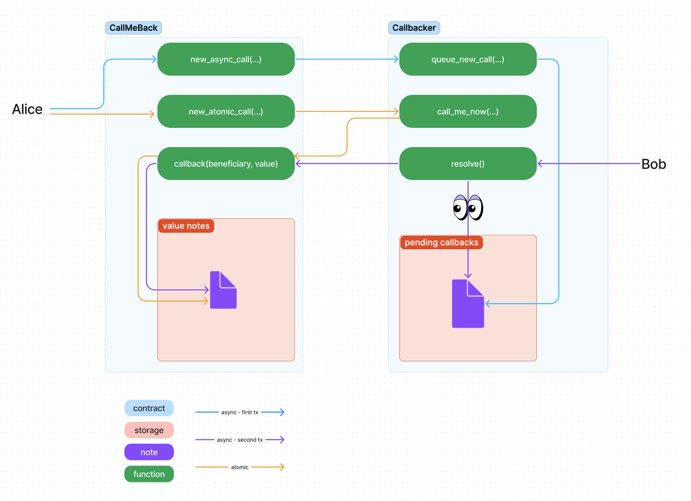

# Callback Pattern

This is an example of callback patterns in Aztec.

In this example, the callback effect is to set a value note for the original sender, Alice.

Two types of callback are demonstrated: atomic and asynchronous.

There are 2 contracts and 2 parties involved:
- Alice: initiate the flow and receive the effect of the callback
- Bob: trigger the logic on the callbacker contract, if the callback is async (see below)
- call_me_back contract: initiate the flow, calls callbacker and receive the callback
- callbacker contract: either store a pending callback (later resolved by bob) or trigger the callback immediately (if the callback is atomic)

The atomic callback flow is as follow:
1. Alice calls `new_atomic_call(..)` on the `CallMeBack` contract
2. `new_atomic_call(..)` calls `calls call_me_now(..)` on the `Callbacker` contract
3. `call_me_now(..)` calls the `callback(..)` function on the `CallMeBack` contract.

This is a callback often used in flashloans (the callback implementing the logic to execute after the flashloan has been taken) or in AMM swaps (to handle the token transfer to the pool).

> Please note that Aztec does not support (yet) getting a note within the same transaction as it was created, the note is therefore created but not consumable within `new_atomic_call(..)`.
> This is an active area of research and might be supported in future releases.

The async callback flow is as follow:
- First transaction:
1. Alice calls `new_async_call(..)` on the `CallMeBack` contract,
2. `new_async_call(..)` calls `queue_new_call(..)` on the `Callbacker` contract and stores the pending callback (in a note for Bob).
- Second transaction:
1. Bob calls `resolve()` on the `Callbacker` contract
2. `resolve()` calls the `callback(..)` function on the `CallMeBack` contract.

This is a callback used in oracles (the callback implementing the logic to handle the data coming from the oracle, without another transaction from the user)

### Real world example
- [Private oracle](https://github.com/defi-wonderland/aztec-private-oracle): This oracle implementation uses the async callback pattern. A user can ask a question to the oracle and that question is shared with an address called divinity. That divinity will receive a note with the question, and when it has the answer it will call submit_answer to the oracle. This function, in turn, will trigger a callback to the contract where the question came from. By doing this, it allows the contract to make use of that answer.