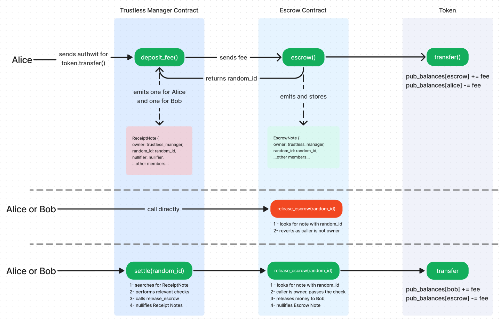

# Contracts as note owners
There are certain cases where we will want to create a note for a trustless third-party that can allow users to perform critical actions, such as note-nullification and state updates when certain conditions are met in order to force users to go through the third-party if they want to execute these actions. Contracts fit the role perfectly, as their logic is immutable and dictated by code. 

Escrowing is a good example. When we escrow something, we first lock that something, and after some condition is met, we release it. Ideally, the power of managing the release of that escrow is given to a trustless third-party. So, following this example, having a contract be the owner of a given note would be fantastic because:
- It allows the escrow contract to dictate how it will integrate with other contracts, and they, in turn, can prepare their logic accordingly.
- It allows the escrow contract to perform checks ensuring only the owner of the note or whoever possess the required authorizations can execute critical actions, such as releasing what's escrowed.
- It allows the third-party contracts to also specify checks to ensure all conditions are met before performing a critical action such as releasing what's escrowed. 

But there are some problems here: 
1. In Aztec, contracts don't have encryption keys, and notes are emitted or created using them. It's true we could always create custom keys for the contracts, but doing this introduces complexity and potential security risks due to mismanagement of these keys. 
1. At the time of nullifying the note, how do we nullify it without a secret derived from a private key? 

Fortunately for us, both of these questions can be answered:
1. We don't need encryption keys to accomplish the desired functionality. Instead, all we need is a custom `owner` field in the note used to perform the appropriate checks. This alone forces the users to go through the third-party contract set as owner of the note to perform any action.

2. Because we can create custom notes, we can define the nullification key we will use for the note. For this, we can add a unique `random_id` or `randomness` field to the note and set it as the note's nullification key. Making it unique is necessary to have a way of fetching the note at the time of releasing what's escrowed. However, because the third-party contract can't decode the contents of the note, it will have to create an extra receipt-like note and save it in storage so it can fetch it once the time to release comes. This note will include the `random_id` because, by doing this, it allows the contract to feed  `random_id` to the escrow contract when what's escrowed has to be released. Because of this, the `random_id` should be returned to the third-party contract at the time of escrowing the contents/creating the note.

At last, it's important to emphasize the control and flexibility we have due to these type of notes being custom. As an example, we can add extra fields beyond the `owner` and `random_id` to perform more checks.

This may look or sound convoluted, but the example code along with the diagram will make it clear.
## Example Diagram
The following diagram shows one of the ways the pattern could be implemented in the example described above:

1. Alice calls deposit fee in Trustless Manager Contract(TMC) having previously authorized the Escrow Contract(EC) to call `transfer()` in the Token Contract(TC). 
1. TMC calls `escrow()` in EC.
1. EC calls the TC in which the fee will be paid, increasing the EC balance and decreasing Alice's.
1. EC creates an EscrowNote for itself and returns the EscrowNote identifier(`random_id`) to TMC. This note sets TMC as its owner.
1. TMC creates a `ReceiptNote` to Alice and Bob including this `random_id`
1. After this, if Alice or Bob tries to call EC to release the funds directly, the call fails as they are not owners of the note.
1. Once all conditions are met, Alice or Bob call `settle()` in TMC.
1. TMC will fetch the ReceiptNote and perform all relevant checks. An example of one could be that certain amount of time has passed, or that a state variable was updated.
1. If everything is correct, TMC calls `release_escrow(random_id)` on EC.
1. `release_escrow` fetches the EscrowNote with the `random_id` and checks if the caller is the owner. As the caller is TMC, which is also the owner, the check passes.
1. `release_escrow` releases the fee to Bob in TC and nullifies the EscrowNote
1. After the call, TMC's `settle()` nullifies the ReceiptNotes.

The rest is up to the contracts integrating with this one to handle. 
## Real Examples

Right now, this pattern can be seen in the interaction between these two repositories:
- https://github.com/defi-wonderland/aztec-token
- https://github.com/defi-wonderland/aztec-private-oracle

When someone submits a question to the oracle, a fee is escrowed in the token contract. The token contract creates a note to the oracle, and returns to the oracle the `escrow_randomness` value, which the oracle then uses to create a `QuestionNote`, which is stored in storage. 

When the answer to the question comes, it fetches the `QuestionNote` using a variety of parameters, and extracts the `escrow_randomness` value from it, and with it, it calls `settle_escrow` in the token contract, which ensures the caller is the oracle contract, and fetches the initial note using the `escrow_randomness`, nullifying it and performing the relevant state updates.